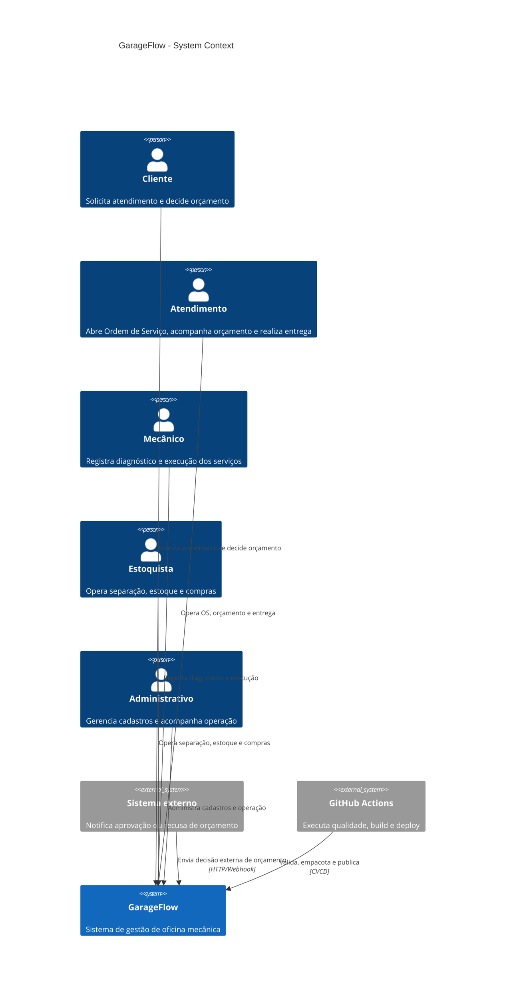
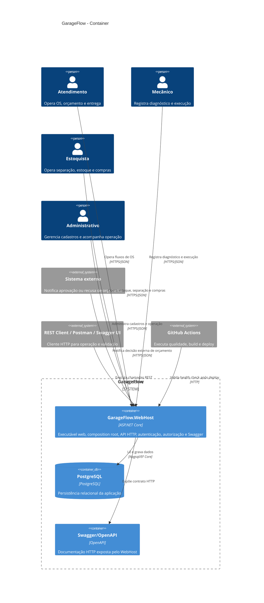

# Architecture Diagrams

## Objetivo
Este documento registra os diagramas arquiteturais canônicos do GarageFlow usando Mermaid.

Referências de sintaxe:
- Architecture diagrams: `architecture-beta`
- C4 diagrams: `C4Context` e `C4Container`

## Visão Geral De Infraestrutura

## C1 — System Context

## C2 — Container

## Observações
- `GarageFlow.Api`, `GarageFlow.Application`, `GarageFlow.Domain` e `GarageFlow.Infrastructure` são assemblies e camadas internas carregadas pelo `GarageFlow.WebHost`.
- No C2, apenas `GarageFlow.WebHost`, PostgreSQL e Swagger/OpenAPI aparecem como containers por representarem unidades executáveis, persistentes ou publicamente expostas.
- O detalhamento interno das camadas fica em `architecture-overview.md`.
- O detalhamento de infraestrutura e deploy fica em `deployment-and-infrastructure.md`.
