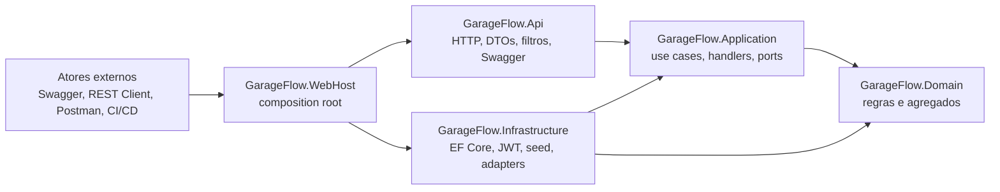

# Architecture Overview

## Arquitetura de Referência
O GarageFlow adota monolito modular em camadas:
- `GarageFlow.WebHost`: executável ASP.NET e composition root.
- `GarageFlow.Api`: entrada HTTP, endpoints, DTOs, filtros, Swagger e políticas de borda.
- `GarageFlow.Application`: casos de uso e orquestração.
- `GarageFlow.Domain`: regras de negócio, agregados, value objects e eventos de domínio.
- `GarageFlow.Infrastructure`: persistência EF Core e implementações técnicas.

## Regra de Dependências
- `WebHost -> Api`, `WebHost -> Application` e `WebHost -> Infrastructure`
- `Api -> Application`
- `Application -> Domain`
- `Infrastructure -> Application` e `Infrastructure -> Domain`
- `Domain` não depende de outras camadas

Objetivo: garantir que regra de negócio não dependa de tecnologia.

## Deploy E Operação
- Docker Compose executa o `GarageFlow.WebHost`.
- Kubernetes local usa os manifests em `/k8s`.
- Terraform em `/infra` provisiona o cluster Kind local.
- GitHub Actions executa CI/CD manual com `Quality`, `E2E`, `Build` e `Deploy Kind`.
- AWS/EKS não faz parte do caminho local padrão; pode ser adicionado como estratégia de deploy cloud.

## Mapeamento DDD para Módulos
Cada bounded context do domínio é implementado como módulo lógico em `Domain` e `Application`:
- `Customers`
- `Catalog`
- `Suppliers`
- `ServiceOrders`
- `Executions`
- `Stock`
- `Purchasing`

## Limites dos Módulos
- Cada módulo controla seus próprios agregados e invariantes.
- Integrações entre módulos ocorrem por Application Services e eventos internos de integração.
- Um módulo não altera estado interno de outro módulo diretamente.

## Contratos Públicos
Os contratos públicos são:
- endpoints REST expostos pela API;
- contratos de eventos internos entre módulos dentro do monólito.
