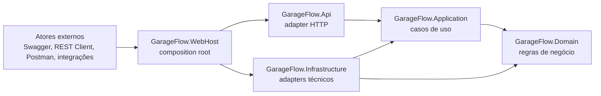
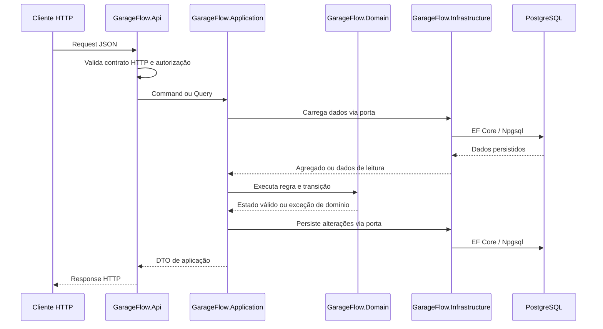

# Clean Architecture

## Objetivo
Este documento descreve como o GarageFlow aplica Clean Architecture e Hexagonal Architecture no monolito modular.

A regra central é manter as regras de negócio independentes de HTTP, banco de dados, autenticação, Swagger, Docker, Kubernetes ou qualquer mecanismo externo.

## Camadas

### `GarageFlow.WebHost`
Projeto executável ASP.NET Core.

Responsabilidades:
- atuar como composition root;
- carregar configuração;
- registrar autenticação, autorização, Swagger, Application e Infrastructure;
- executar migração e seed de inicialização;
- montar o pipeline HTTP;
- hospedar os endpoints definidos pela API.

O `WebHost` é o único projeto que conhece simultaneamente `Api`, `Application` e `Infrastructure`.

### `GarageFlow.Api`
Adapter de entrada HTTP.

Responsabilidades:
- declarar endpoints REST;
- receber requests e retornar responses HTTP;
- aplicar filtros, error handling, Swagger e políticas de autorização;
- converter contratos HTTP para commands, queries e DTOs da Application.

A API não referencia Infrastructure nem Domain. Quando precisa acionar regra de negócio, chama handlers da Application.

### `GarageFlow.Application`
Camada de casos de uso.

Responsabilidades:
- implementar handlers de comandos e consultas;
- orquestrar fluxos entre módulos;
- controlar unidade transacional de cada caso de uso;
- declarar portas usadas por adapters de saída;
- traduzir dados entre domínio e DTOs de aplicação;
- aplicar regras de autorização por caso de uso quando necessário.

A Application referencia o Domain porque casos de uso manipulam agregados, value objects, eventos e contratos de repositório definidos pelo domínio.

### `GarageFlow.Domain`
Núcleo de negócio.

Responsabilidades:
- manter agregados, entidades, value objects, enums, eventos e invariantes;
- validar transições de estado;
- expor contratos de repositório por agregado raiz;
- concentrar mensagens e exceções de domínio.

O Domain não referencia nenhuma outra camada interna.

### `GarageFlow.Infrastructure`
Adapters de saída e implementações técnicas.

Responsabilidades:
- implementar persistência com EF Core;
- manter migrations e configurações do banco;
- implementar repositórios;
- implementar autenticação local, JWT, seed e serviços técnicos;
- implementar portas declaradas pela Application.

Infrastructure referencia Application e Domain porque adapta tecnologia externa aos contratos internos.

## Regra De Dependências

Dependências permitidas:
- `WebHost -> Api`
- `WebHost -> Application`
- `WebHost -> Infrastructure`
- `Api -> Application`
- `Application -> Domain`
- `Infrastructure -> Application`
- `Infrastructure -> Domain`

Dependências proibidas:
- `Api -> Infrastructure`
- `Api -> Domain`
- `Domain -> Application`
- `Domain -> Infrastructure`
- `Domain -> Api`
- `Application -> Infrastructure`

## Fluxo De Requisição

## Padrões De Fronteira

### Commands, Queries E Handlers
- Endpoints não executam regra de negócio diretamente.
- Cada operação relevante entra na Application por command, query ou handler dedicado.
- Handlers coordenam repositórios, serviços técnicos e agregados.
- Um handler deve deixar claro qual caso de uso está sendo executado.

### Ports E Adapters
- A Application ou o Domain declaram contratos internos.
- Infrastructure implementa esses contratos usando tecnologia concreta.
- API e integrações externas são adapters de entrada.
- EF Core, JWT, seed, clock e serviços técnicos são adapters de saída.

### DTOs E Mappers
- Contratos HTTP ficam na API.
- DTOs de caso de uso ficam na Application.
- Tipos de domínio não devem vazar para responses HTTP.
- Conversões entre enumerações, value objects e contratos externos devem ser explícitas e testadas.

### Repositórios
- Repositório é definido por agregado raiz.
- A interface fica no núcleo interno que expressa a necessidade de negócio.
- A implementação concreta fica em Infrastructure.
- Código de API não acessa `DbContext`, migrations ou EF Core.

### Erros E Exceções
- Falhas de domínio são expressas por exceções ou tipos estáveis do domínio.
- A API traduz falhas para HTTP em um ponto central de error handling.
- Decisões de status HTTP não devem depender de parsing textual de mensagens.

### Composition Root
- Registro de dependências concretas fica no `WebHost`.
- `AddApplication` registra casos de uso e serviços de aplicação.
- `AddInfrastructure` registra banco, repositórios, autenticação, seed e adapters técnicos.
- A API declara endpoints e políticas de borda, mas não registra implementações de infraestrutura.

## Exemplos Práticos

Permitido:
- endpoint criar um command da Application;
- handler carregar agregado por repositório;
- agregado validar transição de estado;
- Infrastructure implementar repositório com EF Core;
- WebHost chamar `AddInfrastructure`.

Proibido:
- endpoint resolver `GarageFlowDbContext`;
- endpoint executar migration ou seed;
- API importar namespace de Infrastructure;
- API retornar tipo de Domain em response pública;
- Application depender de EF Core;
- Domain depender de logging, HTTP, banco ou configuração.

## Relação Com Outros Documentos
- Visão executiva e módulos: [docs/architecture/architecture-overview.md](architecture-overview.md)
- Diagramas C1, C2 e infraestrutura: [docs/architecture/architecture-diagrams.md](architecture-diagrams.md)
- Fluxos de aplicação e integrações: [docs/architecture/application-and-integrations.md](application-and-integrations.md)
- Infraestrutura e deploy: [docs/architecture/deployment-and-infrastructure.md](deployment-and-infrastructure.md)
- Padrões de engenharia: [docs/architecture/engineering-standards.md](engineering-standards.md)
