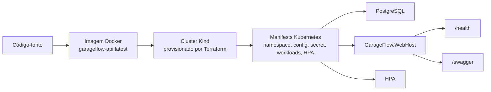

# Deployment and Infrastructure

## Objetivo
Este documento descreve a infraestrutura provisionada e o fluxo de deploy do GarageFlow em ambiente local reproduzível e na esteira de CI/CD.

## Infraestrutura Provisionada
O GarageFlow usa um caminho de infraestrutura local composto por Docker, Terraform, Kind e Kubernetes.

Componentes:
- `Dockerfile`: empacota o executável `GarageFlow.WebHost` em uma imagem da aplicação.
- `docker-compose.yml`: executa a aplicação, PostgreSQL e serviços auxiliares em ambiente local.
- `infra/`: provisiona e destrói um cluster Kubernetes local com Kind via Terraform.
- `k8s/`: declara os workloads e recursos Kubernetes da aplicação.
- `.github/workflows`: executa qualidade, E2E, build da imagem e deploy em Kind na CI/CD.

Recursos Kubernetes:
- namespace `garageflow`;
- ConfigMap `garageflow-config`;
- Secret `garageflow-secret`;
- PostgreSQL com `Deployment`, `Service` e `PersistentVolumeClaim`;
- aplicação `garageflow-webhost` com `Deployment` e `Service`;
- HPA `garageflow-webhost` com escala por CPU e memória;
- metrics-server como add-on do cluster para métricas reais de HPA.

## Fluxo De Deploy
O deploy local usa a imagem Docker produzida a partir do código-fonte e os manifests declarados em `/k8s`.

Sequência operacional:
1. Gerar a imagem da aplicação com `docker build`.
2. Provisionar o cluster local com Terraform em `/infra`.
3. Carregar a imagem local no cluster Kind.
4. Aplicar `k8s/namespace.yaml`.
5. Aplicar os demais manifests de `/k8s`.
6. Aguardar rollout de PostgreSQL e WebHost.
7. Validar HPA e métricas quando o metrics-server estiver instalado.
8. Expor a aplicação localmente com `kubectl port-forward`.
9. Validar `/health` e Swagger.

## Deploy Na CI/CD
A esteira `GarageFlow CI/CD` reproduz o deploy Kubernetes em um cluster Kind efêmero.

Stages:
- `Quality`: build, testes sem E2E, cobertura, segurança e breakdown.
- `E2E`: fluxos ponta a ponta com PostgreSQL service dedicado.
- `Build`: build da imagem Docker e publicação como artifact.
- `Deploy Kind`: carga da imagem, criação do cluster, aplicação dos manifests, rollout, HPA e health check.

O deploy cloud não faz parte do caminho padrão. Uma estratégia cloud pode ser adicionada sem substituir o caminho local reproduzível.

## Referências
- Kubernetes: `k8s/README.md`
- Terraform local: `infra/README.md`
- CI/CD: `docs/architecture/ci.md`
- Operação e qualidade: `docs/architecture/operations-and-quality.md`
