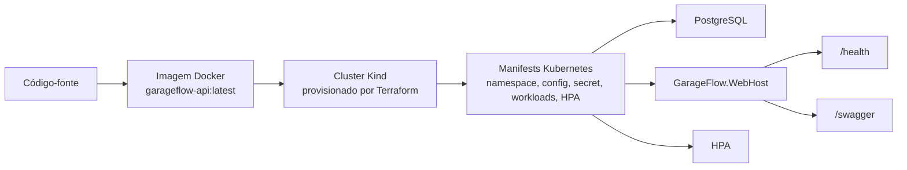

# Deployment and Infrastructure

## Objetivo
Este documento descreve a infraestrutura provisionada e o fluxo de deploy do GarageFlow em ambiente local reproduzível e na esteira de CI/CD.

## Infraestrutura Provisionada
O GarageFlow usa um caminho de infraestrutura local composto por Docker, Terraform, Kind e Kubernetes.

Componentes:
- [Dockerfile](../../Dockerfile): empacota o executável `GarageFlow.WebHost` em uma imagem da aplicação.
- [docker-compose.yml](../../docker-compose.yml): executa a aplicação, PostgreSQL e serviços auxiliares em ambiente local.
- `infra/`: provisiona e destrói um cluster Kubernetes local com Kind via Terraform.
- `k8s/`: declara os workloads e recursos Kubernetes da aplicação.
- `.github/workflows`: executa qualidade, E2E, build da imagem e deploy em Kind na CI/CD.

Recursos Kubernetes:
- namespace `garageflow`;
- ConfigMap `garageflow-config`;
- Secret `garageflow-secret`;
- PostgreSQL com `Deployment`, `Service` e `PersistentVolumeClaim`;
- aplicação `garageflow-webhost` com `Deployment` e `Service`;
- HPA `garageflow-webhost` com escala por CPU e memória;
- metrics-server como add-on do cluster para métricas reais de HPA.

## Fluxo De Deploy
O deploy local usa a imagem Docker produzida a partir do código-fonte e os manifests declarados em `/k8s`.



Sequência operacional:
1. Gerar a imagem da aplicação com `docker build`.
2. Provisionar o cluster local com Terraform em `/infra`.
3. Carregar a imagem local no cluster Kind.
4. Aplicar [k8s/namespace.yaml](../../k8s/namespace.yaml).
5. Aplicar os demais manifests de `/k8s`.
6. Aguardar rollout de PostgreSQL e WebHost.
7. Validar HPA e métricas quando o metrics-server estiver instalado.
8. Expor a aplicação localmente com `kubectl port-forward`.
9. Validar `/health` e Swagger.

## Runbook Local
Este runbook sobe a infraestrutura local a partir de um ambiente limpo, sem executar carga de dados de demonstração.

### Limpeza
Para remover recursos locais da aplicação e do cluster Kind provisionado pelo Terraform:

```bash
./scripts/teardown-local-infra.sh
```

### Subida Do Ambiente
Na raiz do repositório, gere a imagem Docker:

```bash
docker build --no-cache -t garageflow-api:latest .
```

Provisione o cluster Kubernetes local:

```bash
cd infra
terraform apply -auto-approve
cd ..
```

Carregue a imagem no cluster Kind:

```bash
kind load docker-image garageflow-api:latest --name garageflow
```

Aplique os manifests Kubernetes:

```bash
kubectl apply -f k8s/namespace.yaml
kubectl apply -f k8s/
```

Aguarde os rollouts e confira os recursos:

```bash
kubectl rollout status deployment/garageflow-postgres -n garageflow
kubectl rollout status deployment/garageflow-webhost -n garageflow
kubectl get all -n garageflow
kubectl get pvc,configmap,secret,hpa -n garageflow
```

### Metrics Server Para HPA
O metrics-server é necessário para o HPA exibir métricas reais e tomar decisões de escala por CPU/memória.

```bash
kubectl apply -f https://github.com/kubernetes-sigs/metrics-server/releases/latest/download/components.yaml
kubectl patch deployment metrics-server -n kube-system --type='json' -p='[{"op":"add","path":"/spec/template/spec/containers/0/args/-","value":"--kubelet-insecure-tls"}]'
kubectl rollout status deployment/metrics-server -n kube-system --timeout=120s
kubectl top pods -n garageflow
kubectl get hpa -n garageflow
```

### Acesso Local
Em um terminal dedicado:

```bash
kubectl port-forward -n garageflow service/garageflow-webhost 8080:8080
```

Em outro terminal:

```bash
curl http://localhost:8080/health
```

Swagger:

```text
http://localhost:8080/swagger
```

## Deploy Na CI/CD
A esteira `GarageFlow CI/CD` reproduz o deploy Kubernetes em um cluster Kind efêmero.

Stages:
- `Quality`: build, testes sem E2E, cobertura, segurança e breakdown.
- `E2E`: fluxos ponta a ponta com PostgreSQL service dedicado.
- `Build`: build da imagem Docker e publicação como artifact.
- `Deploy Kind`: carga da imagem, criação do cluster, aplicação dos manifests, rollout, HPA e health check.

O deploy cloud não faz parte do caminho padrão. Uma estratégia cloud pode ser adicionada sem substituir o caminho local reproduzível.

## Referências
- Diagramas de arquitetura: [docs/architecture/architecture-diagrams.md](architecture-diagrams.md)
- Kubernetes: [k8s/README.md](../../k8s/README.md)
- Terraform local: [infra/README.md](../../infra/README.md)
- CI/CD: [docs/architecture/ci.md](ci.md)
- Operação e qualidade: [docs/architecture/operations-and-quality.md](operations-and-quality.md)
