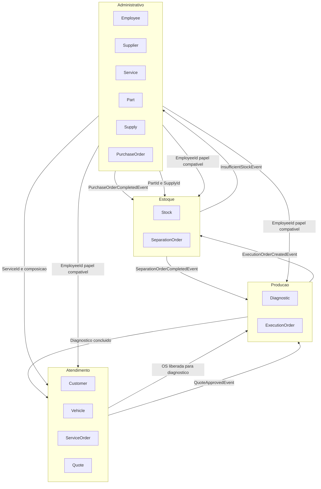
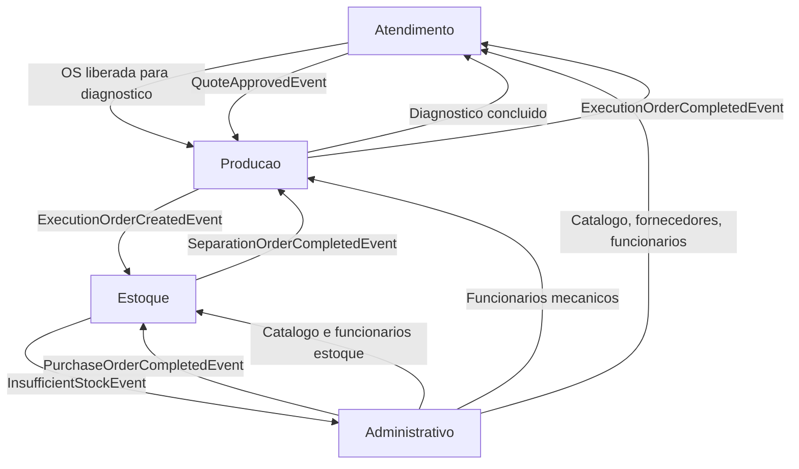

# GarageFlow - Bounded Contexts

## Visao Geral
O dominio do GarageFlow esta organizado em 4 contextos delimitados, alinhados ao fluxo operacional:
- Atendimento
- Producao
- Estoque
- Administrativo

---

## Mapa de Contextos

---

## 1. Atendimento

Responsabilidade: receber o cliente, abrir e conduzir a OS ate aprovacao/reprovacao de orcamento.

Agregados/entidades:
- `Customer`
- `Vehicle`
- `ServiceOrder`
- `Quote`

Regras criticas:
- cadastro e manutencao de cliente e veiculo
- `ServiceOrder` nasce com `FrontDeskEmployeeId` obrigatorio
- orcamento e gerado a partir dos servicos consolidados
- aceite/rejeicao do orcamento ocorre neste contexto

Comunicações:
- consome `ServiceId` e composicao do contexto Administrativo
- consome `EmployeeId` para papeis de atendimento
- publica liberacao para diagnostico (handoff para Producao)
- publica `QuoteApprovedEvent` para Producao
- consome evento de execucao concluida para progresso da OS

---

## 2. Producao

Responsabilidade: executar o trabalho tecnico (diagnostico e execucao).

Agregados/entidades:
- `Diagnostic`
- `ExecutionOrder`

Regras criticas:
- diagnostico e responsabilidade operacional da Producao
- `Diagnostic` exige `MechanicId` compativel
- `ExecutionOrder` exige `MechanicId` obrigatorio na criacao
- execucao so inicia apos disponibilidade da separacao

Comunicações:
- consome OS liberada e `QuoteApprovedEvent` de Atendimento
- consome `EmployeeId` para papel de mecanico
- publica `ExecutionOrderCreatedEvent` para Estoque
- consome `SeparationOrderCompletedEvent` do Estoque
- publica `ExecutionOrderCompletedEvent` para Atendimento

---

## 3. Estoque

Responsabilidade: disponibilidade de itens e ordem de retirada/separacao para execucao.

Agregados:
- `Stock`
- `SeparationOrder`

Regras criticas:
- `SeparationOrder` representa a ordem de retirada
- retirada exige `StockistId` compativel
- confirmacao do mecanico encerra a separacao
- insuficiencia de estoque aciona compra

Comunicações:
- consome `ExecutionOrderCreatedEvent` da Producao
- consome `EmployeeId` para papel de estoquista
- publica `SeparationOrderCompletedEvent` para Producao
- publica `InsufficientStockEvent` para Administrativo
- consome `PurchaseOrderCompletedEvent` do Administrativo

---

## 4. Administrativo

Responsabilidade: governanca dos cadastros mestres (CRUDs) e fluxo de compra.

Agregados:
- `Employee`
- `Supplier`
- `Service`
- `Part`
- `Supply`
- `PurchaseOrder`

Regras criticas:
- concentra CRUDs administrativos
- `PurchaseOrder` tem um `EmployeeId` responsavel
- atribuicao de fornecedor, inicio e conclusao da compra respeitam papel compativel
- conclusao da compra reativa separacoes pendentes

Comunicações:
- fornece mestres para os demais contextos (`Service`, `Part`, `Supply`, `Supplier`, `Employee`)
- consome `InsufficientStockEvent` do Estoque
- publica `PurchaseOrderCompletedEvent` para Estoque

---

## Diagrama de Comunicacoes entre Contextos

