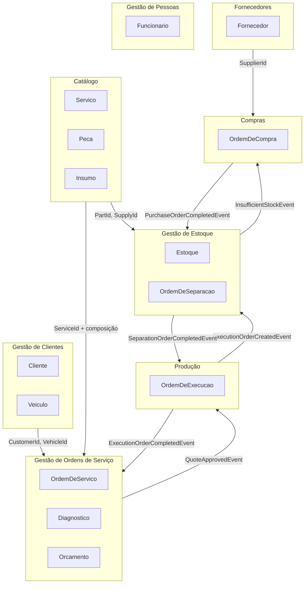
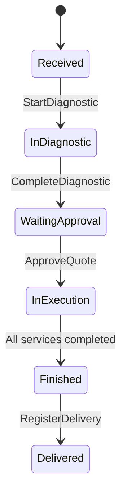
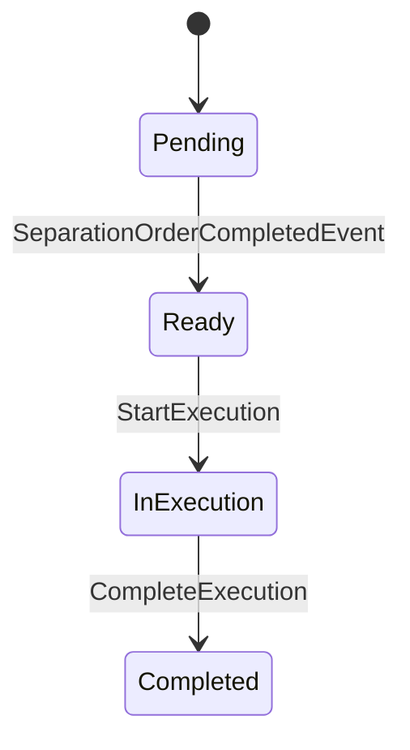
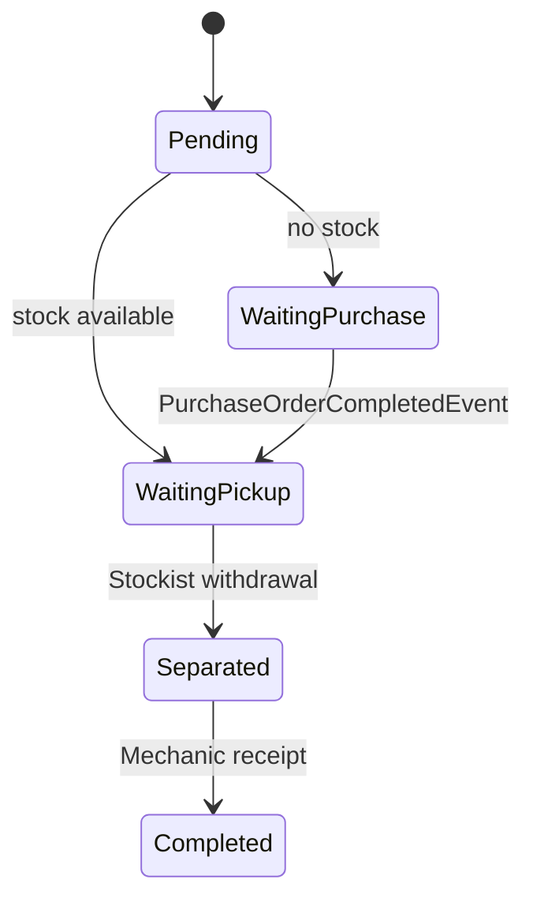
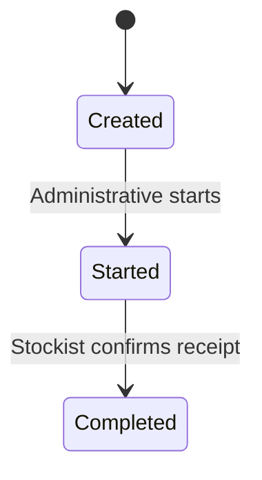
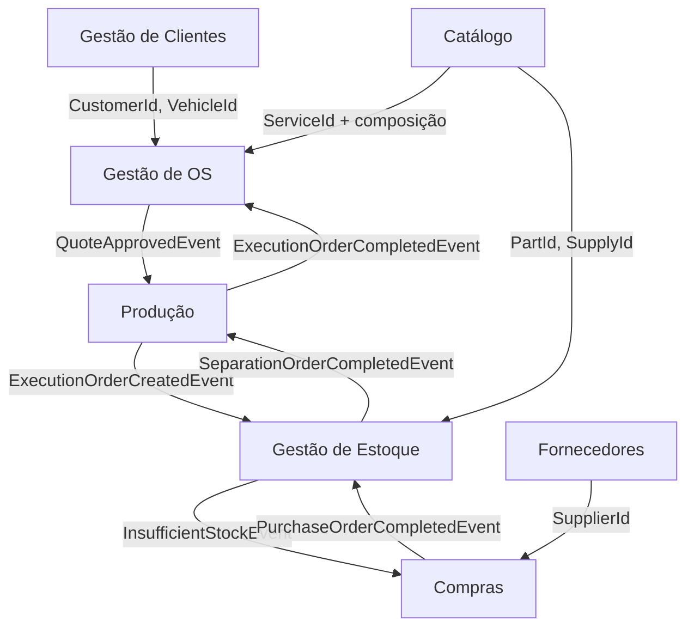

# GarageFlow — Bounded Contexts

## Visão Geral
O domínio do GarageFlow é dividido em 8 contextos delimitados.
Cada contexto tem responsabilidade única e se comunica com os demais por eventos de integração.

---

## Mapa de Contextos

---

## 1. Gestão de Clientes

Responsabilidade: cadastro e histórico de clientes e veículos.

Agregados:
- `Customer` (CPF/CNPJ)
- `Vehicle` (LicensePlate/Renavam)

Regras críticas:
- CPF/CNPJ únicos
- Placa/RENAVAM únicos
- veículo pertence a um único cliente
- remoção lógica (soft delete)

Comunicações:
- fornece `CustomerId` e `VehicleId` para Gestão de Ordens de Serviço

---

## 2. Catálogo

Responsabilidade: definição de serviços, peças e insumos ofertados.

Agregados:
- `Service`
- `Part`
- `Supply`

Regras críticas:
- serviço, peça e insumo são desativáveis (soft delete)
- `Service` mantém composição pré-definida de peças e insumos
- composição de serviço só aceita itens não duplicados e quantidades > 0
- `BasePrice` do serviço é a fonte de preço de mão de obra no orçamento
- `Part` mantém `Code` e `Sku` como identificadores de catálogo
- `Supply` mantém `Code`, `UnitOfMeasure`, `BaseCost` e pode referenciar `PreferredSupplierId`

Comunicações:
- fornece `ServiceId` e composição para Gestão de Ordens de Serviço
- fornece `PartId` e `SupplyId` para Gestão de Estoque

---

## 3. Fornecedores

Responsabilidade: cadastro de fornecedores de peças e insumos.

Agregado:
- `Supplier`

Regras críticas:
- CNPJ único
- remoção lógica (soft delete)

Comunicações:
- fornece `SupplierId` para Compras

---

## 4. Gestão de Pessoas

Responsabilidade: cadastro e ciclo de vida de funcionários internos do sistema.

Agregado:
- `Employee`

Regras críticas:
- CPF/CNPJ únicos no contexto de funcionários
- cargo obrigatório
- remoção lógica (soft delete)

Comunicações:
- fornece identidade e papel para fluxos operacionais do sistema

---

## 5. Gestão de Ordens de Serviço

Responsabilidade: controle do ciclo de vida da OS, diagnóstico e orçamento.

Agregados/entidades:
- `ServiceOrder` (raiz)
- `Diagnostic` (entidade interna)
- `Quote` (entidade interna)
- `ServiceItem` (value object interno)

Status da OS:

Regras críticas:
- `CustomerId` e `VehicleId` imutáveis
- mecânico seleciona serviços no diagnóstico
- peças e insumos não são cadastrados manualmente no diagnóstico
- após `Diagnostic.Completed`, não há reabertura
- `Quote` calcula:
  - `LaborPrice` via `Service.BasePrice`
  - `PartsTotal` e `SuppliesTotal` via preços de catálogo no momento da geração
- `ServiceItem` é snapshot estrutural (sem preço)

Comunicações:
- consome `CustomerId` e `VehicleId` de Gestão de Clientes
- consome `ServiceId` e composição do Catálogo
- publica `QuoteApprovedEvent` para Produção
- consome `ExecutionOrderCompletedEvent` para progresso da OS

---

## 6. Produção

Responsabilidade: execução de serviços pelos mecânicos.

Agregado:
- `ExecutionOrder`

Status:

Regras críticas:
- criado automaticamente ao aprovar orçamento (1 por serviço)
- só inicia execução após separação concluída
- registra tempo real da execução

Comunicações:
- consome `QuoteApprovedEvent`
- publica `ExecutionOrderCreatedEvent`
- publica `ExecutionOrderReadyEvent`
- publica `ExecutionOrderCompletedEvent`
- consome `SeparationOrderCompletedEvent`

---

## 7. Gestão de Estoque

Responsabilidade: controle de saldo e separação física para execução.

Agregados:
- `Stock`
- `SeparationOrder`

Status da separação:

Regras críticas:
- separação criada automaticamente por execução
- separação mantém listas separadas de peças e insumos
- cancelamento antes da execução:
  - peça pode retornar ao estoque
  - insumo não retorna após separação
- `AvailableQuantity` nunca negativa

Comunicações:
- consome `ExecutionOrderCreatedEvent`
- publica `SeparationOrderCompletedEvent`
- publica `InsufficientStockEvent`
- consome `PurchaseOrderCompletedEvent`

---

## 8. Compras

Responsabilidade: reposição de estoque por ordem de compra.

Agregado:
- `PurchaseOrder`

Status:

Regras críticas:
- geração automática quando há insuficiência
- fornecedor obrigatório para iniciar
- conclusão aciona retomada automática de separações pendentes

Comunicações:
- consome `InsufficientStockEvent`
- consome `SupplierId`
- publica `PurchaseOrderCompletedEvent`

---

## Diagrama de Comunicações entre Contextos

