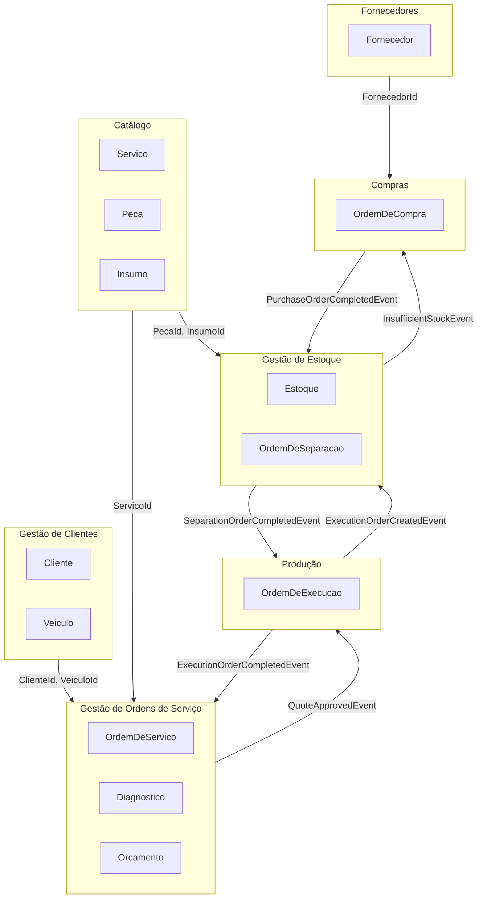
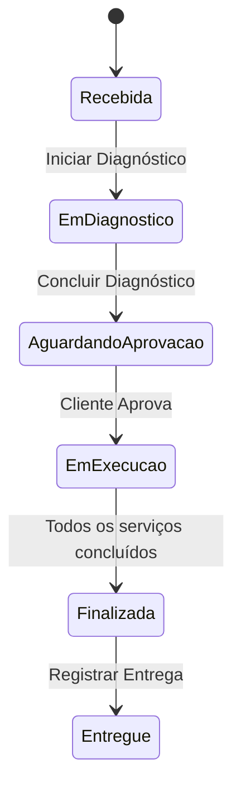
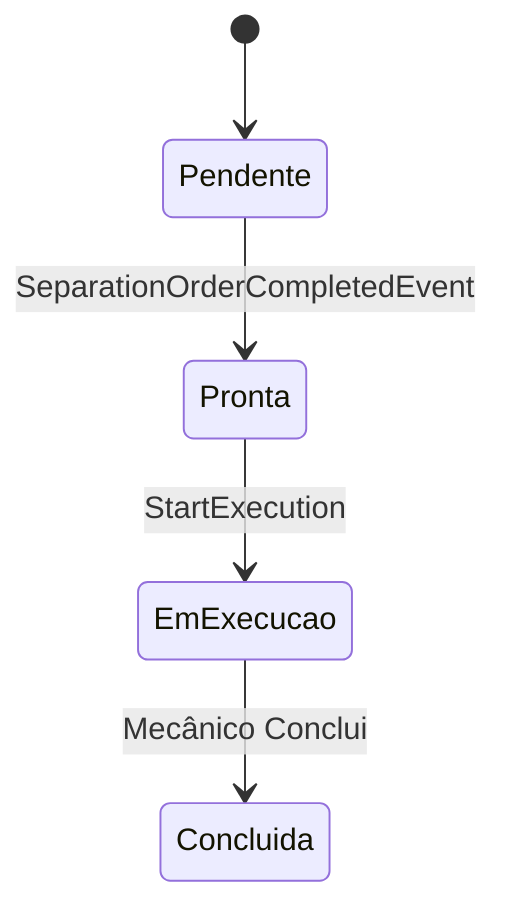
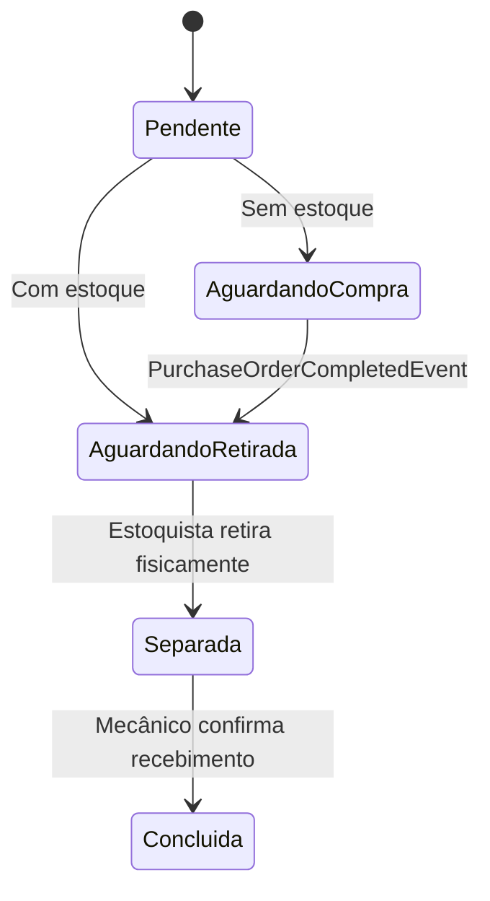
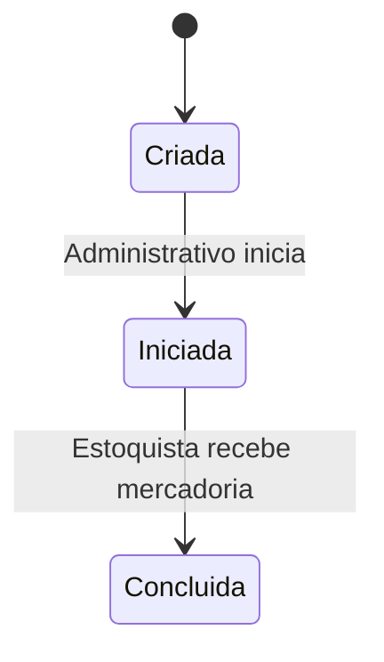
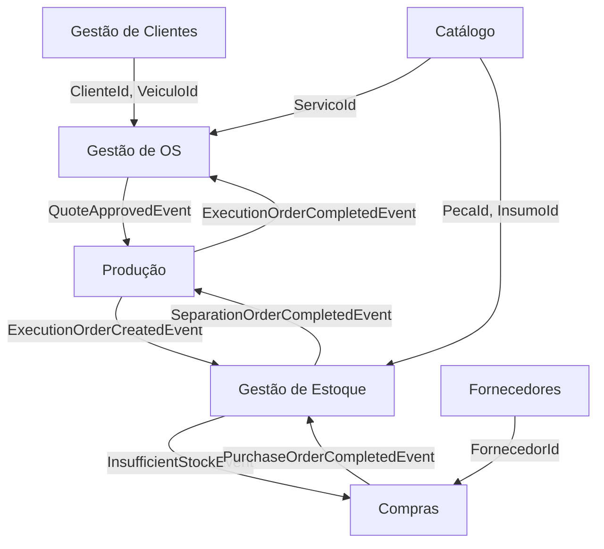

# GarageFlow — Bounded Contexts

## Visão Geral

O domínio do GarageFlow é dividido em 7 contextos delimitados.
Cada contexto tem responsabilidade única e se comunica com
os demais através de eventos de integração.

---

## Mapa de Contextos

---

## 1. Gestão de Clientes

**Responsabilidade:** Cadastro e histórico de clientes e veículos.

**Agregados:**
- Cliente — identificado por CPF (PF) ou CNPJ (PJ)
- Veículo — identificado por Placa e RENAVAM

**Regras críticas:**
- CPF e CNPJ são únicos no sistema
- Placa e RENAVAM são únicos no sistema
- Um veículo pertence a um único cliente
- Cliente nunca é deletado — apenas desativado

**Comunicações:**
- Fornece ClienteId e VeiculoId para Gestão de Ordens de Serviço

---

## 2. Catálogo

**Responsabilidade:** Definição dos serviços, peças e insumos
oferecidos pela oficina.

**Agregados:**
- Serviço — tipo de serviço com preço base e tempo estimado
- Peça — componente físico substituível, controlado por unidade
- Insumo — material consumível, controlado por quantidade variável

**Regras críticas:**
- Serviços, peças e insumos nunca são deletados — apenas desativados
- Tempo médio estimado é atualizado manualmente pelo administrativo
- Preço base pode ser sobrescrito no orçamento da OS

**Comunicações:**
- Fornece ServicoId, PecaId e InsumoId para Gestão de Ordens de Serviço
- Fornece PecaId e InsumoId para Gestão de Estoque

---

## 3. Fornecedores

**Responsabilidade:** Cadastro de fornecedores de peças e insumos.

**Agregados:**
- Fornecedor — identificado por CNPJ

**Regras críticas:**
- CNPJ é único no sistema
- Fornecedor nunca é deletado — apenas desativado

**Comunicações:**
- Fornece FornecedorId para Compras

---

## 4. Gestão de Ordens de Serviço

**Responsabilidade:** Controle do ciclo de vida completo
da Ordem de Serviço.

**Agregados:**
- OrdemDeServico — agregado raiz central
- Diagnostico — análise técnica do veículo
- Orcamento — proposta de custo gerada automaticamente

**Status da OS:**

**Regras críticas:**
- ClienteId e VeiculoId são imutáveis após criação
- OS só vai para Em Execução após aprovação do cliente
- OS só vai para Finalizada quando todos os serviços forem concluídos
- OS mantém contador: TotalServicos e ServicosConcluidos

**Comunicações:**
- Consome ClienteId de Gestão de Clientes
- Consome VeiculoId de Gestão de Clientes
- Consome ServicoId do Catálogo
- Publica `QuoteApprovedEvent` para Produção
- Consome `ExecutionOrderCompletedEvent` de Produção para progresso da OS

---

## 5. Produção

**Responsabilidade:** Controle da execução dos serviços
pelos mecânicos.

**Agregados:**
- OrdemDeExecucao — representa a execução de um serviço
  específico por um mecânico

**Status da Ordem de Execução:**

**Regras críticas:**
- Criada automaticamente ao aprovar orçamento (1 por serviço)
- Só vai para `Pronta` após Ordem de Separação Concluída
- Só vai para Em Execução a partir de `Pronta`
- Registra IniciadoEm, ConcluidoEm e TempoRealMinutos
- Ao concluir, incrementa contador de ServicosConcluidos na OS

**Comunicações:**
- Consome `QuoteApprovedEvent` de Gestão de Ordens de Serviço
- Publica `ExecutionOrderCreatedEvent` para Gestão de Estoque
- Publica `ExecutionOrderReadyEvent` ao marcar prontidão para início
- Publica `ExecutionOrderCompletedEvent` para Gestão de Ordens de Serviço
- Consome `SeparationOrderCompletedEvent` de Gestão de Estoque

---

## 6. Gestão de Estoque

**Responsabilidade:** Controle de disponibilidade de peças
e insumos e separação física para execução dos serviços.

**Agregados:**
- Estoque — controla quantidades de peças e insumos
- OrdemDeSeparacao — separação física de itens para uma OE

**Status da Ordem de Separação:**

**Modelo de Quantidades do Estoque:**
- QuantidadeTotal — total físico no estoque
- QuantidadeDisponivel — livre para novos pedidos
- QuantidadeReservada — bloqueada para ordens em andamento
- QuantidadeMinima — gatilho para geração de Ordem de Compra

**Regras críticas:**
- Criada automaticamente ao criar Ordem de Execução (1 por OE)
- Verificação de estoque automática na criação da Ordem de Separação
- Se falta peça: gera Ordem de Compra e vai para Aguardando Compra
- Se tem peça: reserva e vai para Aguardando Retirada
- QuantidadeDisponivel nunca pode ser negativa
- Estoquista confirma retirada física
- Mecânico confirma recebimento das peças

**Comunicações:**
- Consome `ExecutionOrderCreatedEvent` de Produção
- Publica `SeparationOrderCompletedEvent` para Produção
- Publica `InsufficientStockEvent` para Compras
- Consome `PurchaseOrderCompletedEvent` de Compras

---

## 7. Compras

**Responsabilidade:** Reposição de estoque através de
ordens de compra junto a fornecedores.

**Agregados:**
- OrdemDeCompra — solicitação de compra de peças/insumos

**Status da Ordem de Compra:**

**Regras críticas:**
- Gerada automaticamente pelo sistema quando detecta falta de estoque
- Requer seleção de fornecedor pelo administrativo
- Administrativo inicia o processo de compra
- Estoquista registra o recebimento e atualiza o estoque
- Ao concluir, dispara `PurchaseOrderCompletedEvent` para retomar separações pendentes

**Comunicações:**
- Consome `InsufficientStockEvent` de Gestão de Estoque
- Consome FornecedorId de Fornecedores
- Publica `PurchaseOrderCompletedEvent` para Gestão de Estoque

---

## Diagrama de Comunicações entre Contextos

