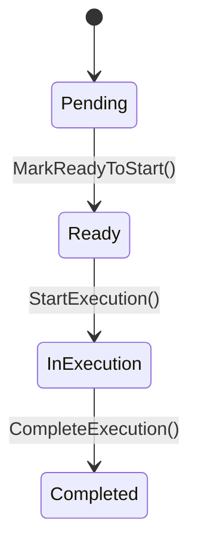

# Ordem de Execução — Agregado Raiz

## Metadados
- Classe C#: `ExecutionOrder`
- Tipo: Agregado Raiz
- Bounded Context: Produção
- Namespace: `GarageFlow.Domain.Executions`
- Arquivo: `GarageFlow.Domain/Executions/ExecutionOrder.cs`

## Responsabilidade
Representa a execução de um serviço específico de uma Ordem de Serviço por um
mecânico. Controla prontidão para início, início e conclusão da execução, além
do registro do tempo real gasto no serviço.

## Atributos
| Atributo | Tipo C# | Obrigatório | Regra |
|----------|---------|-------------|-------|
| Id | `Guid` | Sim | Gerado automaticamente via `Guid.NewGuid()` |
| ServiceOrderId | `Guid` | Sim | Imutável após criação |
| ServiceId | `Guid` | Sim | Imutável após criação |
| MechanicId | `Guid?` | Não | Nulo até `StartExecution()` |
| Status | `ExecutionOrderStatus` | Sim | Fluxo obrigatório: `Pending -> Ready -> InExecution -> Completed` |
| StartedAt | `DateTime?` | Não | Nulo até iniciar execução |
| CompletedAt | `DateTime?` | Não | Nulo até concluir execução |
| ActualTimeMinutes | `decimal?` | Não | Calculado automaticamente ao concluir (RN-010) |
| CreatedAt | `DateTime` | Sim | Definido como `DateTime.UtcNow` no `Create()` |

> **Enum `ExecutionOrderStatus`:**
> ```
> Pending, Ready, InExecution, Completed
> ```

## Invariantes
1. `ServiceOrderId` nunca pode ser alterado após criação
2. `ServiceId` nunca pode ser alterado após criação
3. `MechanicId` é obrigatório para iniciar execução (RN-009)
4. `StartExecution()` só é permitido quando `Status == Ready` (RN-009)
5. `Status` só pode avançar na sequência `Pending -> Ready -> InExecution -> Completed`
6. `ActualTimeMinutes` é calculado automaticamente em `CompleteExecution()` usando `(CompletedAt - StartedAt).TotalMinutes` (RN-010)

## Diagrama de Estados


## Métodos de Domínio

### Create(Guid serviceOrderId, Guid serviceId)
- Pré-condição: `serviceOrderId != Guid.Empty`
- Pré-condição: `serviceId != Guid.Empty`
- Ação:
  - Cria instância com `Id = Guid.NewGuid()`
  - Define `Status = Pending`
  - Define `MechanicId = null`, `StartedAt = null`, `CompletedAt = null`, `ActualTimeMinutes = null`
  - Define `CreatedAt = DateTime.UtcNow`
- Pós-condição: ordem de execução criada e pendente
- Evento emitido: `ExecutionOrderCreatedEvent`
- Exceções:
  - `DomainException("OS é obrigatória")`
  - `DomainException("Serviço é obrigatório")`

### MarkReadyToStart()
- Pré-condição: nenhuma (método idempotente)
- Ação:
  - Se `Status == Pending`, define `Status = Ready`
  - Se `Status` já for `Ready`, `InExecution` ou `Completed`, não altera estado e não lança erro
- Pós-condição: ordem apta para início (`Ready`) ou mantida sem efeito em chamadas duplicadas
- Evento emitido: `ExecutionOrderReadyEvent` (somente quando houver transição `Pending -> Ready`)

### StartExecution(Guid mechanicId)
- Pré-condição: `Status == Ready`
- Pré-condição: `mechanicId != Guid.Empty`
- Ação:
  - Define `Status = InExecution`
  - Define `MechanicId = mechanicId`
  - Define `StartedAt = DateTime.UtcNow`
- Pós-condição: execução iniciada com mecânico responsável definido
- Evento emitido: `ExecutionOrderStartedEvent`
- Exceções:
  - `DomainException("Ordem de Execução não está Pronta para Início")`
  - `DomainException("Mecânico é obrigatório")`

### CompleteExecution()
- Pré-condição: `Status == InExecution`
- Pré-condição: `StartedAt` possui valor
- Ação:
  - Define `Status = Completed`
  - Define `CompletedAt = DateTime.UtcNow`
  - Define `ActualTimeMinutes = (decimal)(CompletedAt.Value - StartedAt.Value).TotalMinutes`
- Pós-condição: execução concluída com tempo real registrado
- Evento emitido: `ExecutionOrderCompletedEvent`
- Exceção: `DomainException("Ordem de Execução não está Em Execução")`

> **Comentário obrigatório — gate RN-009 e fronteira entre agregados:**
> O estado da `SeparationOrder` não é consultado diretamente pelo `ExecutionOrder`.
> Ao receber `SeparationOrderCompletedEvent`, o Application Service chama
> `MarkReadyToStart()` para transicionar a ordem para `Ready`. A decisão final
> de permitir `StartExecution()` fica no próprio agregado via validação de status.

## Eventos de Domínio
| Evento C# | Quando é emitido |
|-----------|-----------------|
| `ExecutionOrderCreatedEvent` | Ao criar a ordem de execução |
| `ExecutionOrderReadyEvent` | Ao marcar a ordem como pronta para início |
| `ExecutionOrderStartedEvent` | Ao iniciar a execução do serviço |
| `ExecutionOrderCompletedEvent` | Ao concluir a execução do serviço |

## Regras de Negócio Relacionadas
- [RN-008]: `ExecutionOrder` é criada automaticamente ao aprovar orçamento
- [RN-009]: Só inicia execução após dupla confirmação de custódia da `SeparationOrder`
- [RN-010]: Registra `StartedAt`, `CompletedAt` e calcula `ActualTimeMinutes` com precisão decimal

## Implementação C#
- Construtor privado
- Factory method estático `Create()`
- Propriedades com `private set`
- Exceções sempre via `DomainException`

## Dependências
- Agregados externos referenciados por ID: `ServiceOrder`, `Service`
- Integração de fluxo: `SeparationOrder` (via `SeparationOrderCompletedEvent` no Application Service)

## Testes Obrigatórios
- [ ] criar válida
- [ ] criar sem serviceOrderId (erro)
- [ ] `StartExecution()` em `Pending` deve lançar erro de prontidão
- [ ] `MarkReadyToStart()` em `Pending` deve mudar para `Ready` e emitir `ExecutionOrderReadyEvent`
- [ ] `MarkReadyToStart()` duplicado deve ser idempotente (sem erro)
- [ ] iniciar execução com mecânico válido quando `Ready`
- [ ] iniciar sem mecânico (erro)
- [ ] iniciar em status errado (erro)
- [ ] completar execução
- [ ] completar em status errado (erro)
- [ ] verificar cálculo decimal de `ActualTimeMinutes`
