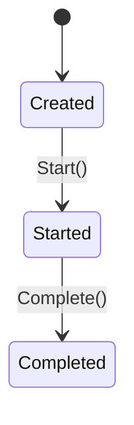

# Ordem de Compra — Agregado Raiz

## Metadados
- Classe C#: `PurchaseOrder`
- Tipo: Agregado Raiz
- Bounded Context: Compras
- Namespace: `GarageFlow.Domain.Purchasing`
- Arquivo: `GarageFlow.Domain/Purchasing/PurchaseOrder.cs`

## Responsabilidade
Representa a compra de peças/insumos para reposição de estoque quando há
insuficiência para atender Ordens de Separação. Controla atribuição de
fornecedor, início e conclusão do processo de compra.

## Atributos
| Atributo | Tipo C# | Obrigatório | Regra |
|----------|---------|-------------|-------|
| Id | `Guid` | Sim | Gerado automaticamente via `Guid.NewGuid()` |
| SeparationOrderIds | `IReadOnlyList<Guid>` | Sim | Deve conter pelo menos 1 `SeparationOrderId` |
| SupplierId | `Guid?` | Não | Nulo até `AssignSupplier()` |
| Status | `PurchaseOrderStatus` | Sim | Fluxo obrigatório: `Created -> Started -> Completed` |
| Items | `IReadOnlyList<PurchaseItem>` | Sim | Deve conter pelo menos 1 item |
| CreatedAt | `DateTime` | Sim | Definido como `DateTime.UtcNow` no `Create()` |
| StartedAt | `DateTime?` | Não | Nulo até `Start()` |
| CompletedAt | `DateTime?` | Não | Nulo até `Complete()` |

> **Enum `PurchaseOrderStatus`:**
> ```
> Created, Started, Completed
> ```

## Entidade Interna — PurchaseItem
`PurchaseItem` representa cada item a ser comprado para reposição.

| Atributo | Tipo C# | Obrigatório | Regra |
|----------|---------|-------------|-------|
| ItemId | `Guid` | Sim | Referência ao item de catálogo |
| ItemType | `PurchaseItemType` | Sim | `Part` ou `Supply` |
| ItemName | `string` | Sim | Nome do item no momento da compra |
| Quantity | `decimal` | Sim | Quantidade a comprar (maior que zero) |
| UnitPrice | `decimal` | Sim | Preço unitário (maior ou igual a zero) |
| Subtotal | `decimal` | Sim | Calculado automaticamente: `UnitPrice * Quantity` |

> **Enum `PurchaseItemType`:**
> ```
> Part, Supply
> ```

## Invariantes
1. `SeparationOrderIds` nunca pode ser vazio
2. `Items` nunca pode ser vazio
3. `SupplierId` é obrigatório antes de `Start()` (RN-019)
4. `Status` só pode avançar na sequência `Created -> Started -> Completed`
5. A criação da ordem é sempre automática pelo sistema (RN-018)

## Diagrama de Estados


## Métodos de Domínio

### Create(IEnumerable<Guid> separationOrderIds, IEnumerable<PurchaseItem> items)
- Pré-condição: `separationOrderIds` não nulo e com pelo menos 1 item
- Pré-condição: `items` não nulo e com pelo menos 1 item
- Pré-condição: cada `PurchaseItem` deve ter:
  - `ItemId != Guid.Empty`
  - `ItemName` não nulo/não vazio após `trim`
  - `Quantity > 0`
  - `UnitPrice >= 0`
- Ação:
  - Cria instância com `Id = Guid.NewGuid()`
  - Define `Status = Created`
  - Define `SupplierId = null`, `StartedAt = null`, `CompletedAt = null`
  - Define `CreatedAt = DateTime.UtcNow`
- Pós-condição: ordem de compra criada e aguardando fornecedor
- Evento emitido: `PurchaseOrderCreatedEvent`
- Exceções:
  - `DomainException("Deve haver pelo menos uma Ordem de Separação")`
  - `DomainException("Ordem de Compra deve ter pelo menos um item")`
  - `DomainException("Item da ordem de compra inválido")`

### AssignSupplier(Guid supplierId)
- Pré-condição: `Status == Created`
- Pré-condição: `supplierId != Guid.Empty`
- Ação:
  - Define `SupplierId = supplierId`
- Pós-condição: fornecedor definido para início da compra
- Exceções:
  - `DomainException("Fornecedor é obrigatório")`
  - `DomainException("Não é possível alterar fornecedor após início")`

### Start()
- Pré-condição: `Status == Created`
- Pré-condição: `SupplierId` possui valor
- Ação:
  - Define `Status = Started`
  - Define `StartedAt = DateTime.UtcNow`
- Pós-condição: compra iniciada
- Evento emitido: `PurchaseOrderStartedEvent`
- Exceções:
  - `DomainException("Fornecedor não foi selecionado")`
  - `DomainException("Ordem de Compra não está no status Criada")`

### Complete()
- Pré-condição: `Status == Started`
- Ação:
  - Define `Status = Completed`
  - Define `CompletedAt = DateTime.UtcNow`
- Pós-condição: compra concluída
- Evento emitido: `PurchaseOrderCompletedEvent`
- Exceção: `DomainException("Ordem de Compra não está Iniciada")`

> **Nota importante — responsabilidade de orquestração externa:**
> Ao concluir (`Complete()`), o agregado `PurchaseOrder` não chama outros
> agregados diretamente. O Application Service, ao reagir ao
> `PurchaseOrderCompletedEvent`, deve:
> 1. Chamar `Stock.Replenish()` para cada item comprado
> 2. Chamar `Stock.Reserve()` para os itens de cada Ordem de Separação afetada
> 3. Chamar `SeparationOrder.ResumeAfterPurchase()` para cada id em `SeparationOrderIds`

> **Comentário obrigatório — Application Service:**
> A atualização de estoque e a retomada das Ordens de Separação pertencem à
> camada de aplicação/orquestração. O agregado `PurchaseOrder` mantém apenas
> suas próprias invariantes e publica eventos de domínio.

## Eventos de Domínio
| Evento C# | Quando é emitido |
|-----------|-----------------|
| `PurchaseOrderCreatedEvent` | Ao criar a ordem de compra |
| `PurchaseOrderStartedEvent` | Ao iniciar a ordem de compra |
| `PurchaseOrderCompletedEvent` | Ao concluir a ordem de compra |

## Regras de Negócio Relacionadas
- [RN-017]: Falta de estoque gera automaticamente Ordem de Compra
- [RN-018]: Ordem de Compra é gerada automaticamente pelo sistema
- [RN-019]: Seleção de fornecedor antes de iniciar compra
- [RN-020]: Conclusão da compra retoma Ordens de Separação em espera

## Implementação C#
- Construtor privado
- Factory method estático `Create()`
- Propriedades com `private set`
- Exceções sempre via `DomainException`
- Normalização textual: aplicar `trim` nas bordas em entradas de texto do agregado

## Dependências
- Agregados externos referenciados por ID: `SeparationOrder`, `Supplier`
- Integração de fluxo: `Stock` (reposição) e `SeparationOrder` (retomada) via Application Service

## Testes Obrigatórios
- [ ] criar válida
- [ ] criar sem separationOrderIds (erro)
- [ ] criar sem items (erro)
- [ ] criar com `PurchaseItem` inválido (erro)
- [ ] atribuir fornecedor válido
- [ ] atribuir fornecedor nulo (erro)
- [ ] iniciar sem fornecedor (erro)
- [ ] iniciar com fornecedor válido
- [ ] iniciar em status errado (erro)
- [ ] completar
- [ ] completar em status errado (erro)
