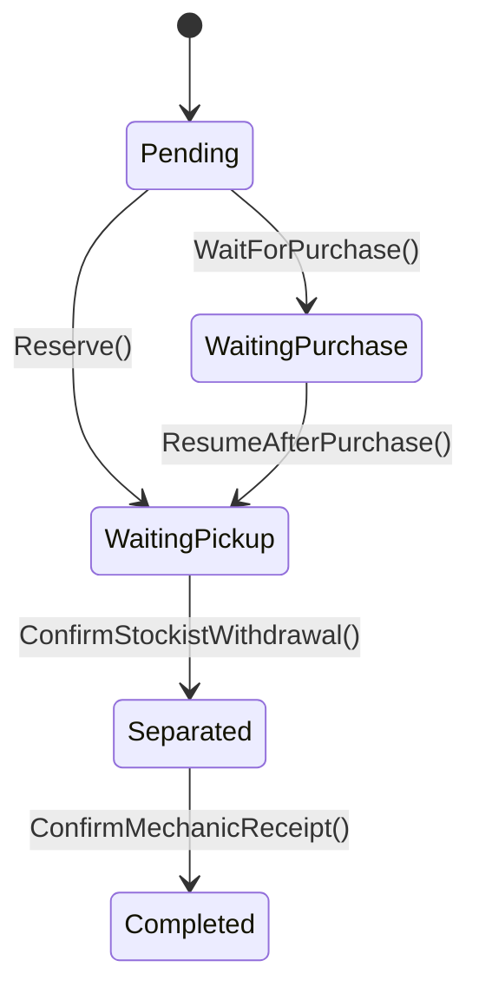

# Ordem de Separação — Agregado Raiz

## Metadados
- Classe C#: `SeparationOrder`
- Tipo: Agregado Raiz
- Bounded Context: Gestão de Estoque
- Namespace: `GarageFlow.Domain.Stock`
- Arquivo: `GarageFlow.Domain/Stock/SeparationOrder.cs`

## Responsabilidade
Representa a separação física de peças e insumos para uma `ExecutionOrder`.
Controla reserva, compra (quando necessário), retirada pelo estoquista e
confirmação de recebimento pelo mecânico, concluindo a custódia dos itens.

## Atributos
| Atributo | Tipo C# | Obrigatório | Regra |
|----------|---------|-------------|-------|
| Id | `Guid` | Sim | Gerado automaticamente via `Guid.NewGuid()` |
| ExecutionOrderId | `Guid` | Sim | Imutável após criação |
| Status | `SeparationOrderStatus` | Sim | Fluxo por dois caminhos: com estoque ou sem estoque |
| Items | `IReadOnlyList<SeparationItem>` | Sim | Deve conter pelo menos 1 item |
| StockistId | `Guid?` | Não | Nulo até confirmação do estoquista |
| ConfirmedByStockistAt | `DateTime?` | Não | Nulo até confirmação do estoquista |
| ConfirmedByMechanicAt | `DateTime?` | Não | Nulo até confirmação do mecânico |
| CreatedAt | `DateTime` | Sim | Definido como `DateTime.UtcNow` no `Create()` |

> **Enum `SeparationOrderStatus`:**
> ```
> Pending, WaitingPurchase, WaitingPickup, Separated, Completed
> ```

## Entidade Interna — SeparationItem
`SeparationItem` representa cada peça/insumo necessário para a execução.

| Atributo | Tipo C# | Obrigatório | Regra |
|----------|---------|-------------|-------|
| ItemId | `Guid` | Sim | Referência ao item de catálogo |
| ItemType | `SeparationItemType` | Sim | `Part` ou `Supply` |
| ItemName | `string` | Sim | Nome do item no momento da separação |
| Quantity | `decimal` | Sim | Quantidade solicitada (maior que zero) |
| IsReserved | `bool` | Sim | Indica se item já foi reservado no estoque |

> **Enum `SeparationItemType`:**
> ```
> Part, Supply
> ```

## Invariantes
1. `ExecutionOrderId` nunca pode ser alterado após criação
2. `Items` nunca pode ser vazio
3. Fluxo de status válido:
   - Caminho 1 (tem estoque): `Pending -> WaitingPickup -> Separated -> Completed`
   - Caminho 2 (sem estoque): `Pending -> WaitingPurchase -> WaitingPickup -> Separated -> Completed`
4. `Completed` só é permitido após dupla confirmação de custódia (RN-013)
5. `ConfirmedByMechanicAt` só pode ser definido após confirmação prévia do estoquista

## Diagrama de Estados


## Métodos de Domínio

### Create(Guid executionOrderId, IEnumerable<SeparationItem> items)
- Pré-condição: `executionOrderId != Guid.Empty`
- Pré-condição: `items` não nulo e com pelo menos 1 item
- Pré-condição: cada `SeparationItem` deve ter:
  - `ItemId != Guid.Empty`
  - `ItemName` não nulo/não vazio após `trim`
  - `Quantity > 0`
- Ação:
  - Cria instância com `Id = Guid.NewGuid()`
  - Define `Status = Pending`
  - Define `StockistId = null`, `ConfirmedByStockistAt = null`, `ConfirmedByMechanicAt = null`
  - Define `CreatedAt = DateTime.UtcNow`
- Pós-condição: ordem de separação criada e pendente
- Evento emitido: `SeparationOrderCreatedEvent`
- Exceções:
  - `DomainException("Ordem de Execução é obrigatória")`
  - `DomainException("Separação deve ter pelo menos um item")`
  - `DomainException("Item de separação inválido")`

### Reserve()
- Pré-condição: `Status == Pending`
- Ação:
  - Define `IsReserved = true` para todos os `Items`
  - Define `Status = WaitingPickup`
- Pós-condição: itens reservados e aguardando retirada
- Evento emitido: nenhum (a reserva efetiva de estoque publica `PartsReservedEvent` em `Stock`)
- Exceção: `DomainException("Separação não está Pendente")`

### WaitForPurchase()
- Pré-condição: `Status == Pending`
- Ação:
  - Define `Status = WaitingPurchase`
- Pós-condição: separação aguardando reposição de estoque
- Evento emitido: nenhum (`InsufficientStockEvent` é publicado por `Stock`)
- Exceção: `DomainException("Separação não está Pendente")`

### ResumeAfterPurchase()
- Pré-condição: `Status == WaitingPurchase`
- Ação:
  - Define `IsReserved = true` para todos os `Items`
  - Define `Status = WaitingPickup`
- Pós-condição: separação retomada após compra concluída
- Exceção: `DomainException("Separação não está Aguardando Compra")`

### ConfirmStockistWithdrawal(Guid stockistId)
- Pré-condição: `Status == WaitingPickup`
- Pré-condição: `stockistId != Guid.Empty`
- Pré-condição: todos os `Items` estão com `IsReserved == true`
- Ação:
  - Define `StockistId = stockistId`
  - Define `ConfirmedByStockistAt = DateTime.UtcNow`
  - Define `Status = Separated`
- Pós-condição: retirada física confirmada pelo estoquista
- Evento emitido: `PartsSeparatedEvent`
- Exceções:
  - `DomainException("Separação não está Aguardando Retirada")`
  - `DomainException("Estoquista é obrigatório")`
  - `DomainException("Itens da separação ainda não foram reservados")`

### ConfirmMechanicReceipt()
- Pré-condição: `Status == Separated`
- Pré-condição: `ConfirmedByStockistAt` possui valor
- Ação:
  - Define `ConfirmedByMechanicAt = DateTime.UtcNow`
  - Define `Status = Completed`
- Pós-condição: custódia concluída com confirmação do mecânico
- Evento emitido: `SeparationOrderCompletedEvent`
- Exceções:
  - `DomainException("Aguardando confirmação do estoquista")`
  - `DomainException("Separação não está Separada")`

> **Comentário obrigatório — dupla confirmação e dois caminhos:**
> A `SeparationOrder` tem dois fluxos possíveis de status (com estoque e sem estoque),
> mas ambos convergem para a mesma regra de custódia: só concluir após confirmação
> do estoquista (retirada física) e do mecânico (recebimento). Essa dupla confirmação
> atende a RN-013 e garante rastreabilidade completa do material.
>
> No caminho sem estoque, a retomada é orquestrada pelo Application Service na
> sequência `Stock.Replenish() -> Stock.Reserve() -> SeparationOrder.ResumeAfterPurchase()`.
> Assim, ao voltar para `WaitingPickup`, a separação já está com itens reservados.

## Eventos de Domínio
| Evento C# | Quando é emitido |
|-----------|-----------------|
| `SeparationOrderCreatedEvent` | Ao criar a ordem de separação |
| `PartsSeparatedEvent` | Ao confirmar retirada física pelo estoquista |
| `SeparationOrderCompletedEvent` | Ao confirmar recebimento pelo mecânico |

## Regras de Negócio Relacionadas
- [RN-011]: Criada automaticamente para cada `ExecutionOrder`
- [RN-012]: Verificação automática de estoque na criação
- [RN-013]: Dupla confirmação de custódia (estoquista + mecânico)
- [RN-020]: Retomada após compra concluída

## Implementação C#
- Construtor privado
- Factory method estático `Create()`
- Propriedades com `private set`
- Exceções sempre via `DomainException`
- Normalização textual: aplicar `trim` nas bordas em entradas de texto do agregado

## Dependências
- Agregados externos referenciados por ID: `ExecutionOrder`
- Integra com: `Stock` (reserva/disponibilidade) e `PurchaseOrder` (retomada)

## Testes Obrigatórios
- [ ] criar válida
- [ ] criar sem executionOrderId (erro)
- [ ] criar sem items (erro)
- [ ] criar com item inválido (erro)
- [ ] reservar estoque disponível
- [ ] marcar aguardando compra
- [ ] retomar após compra
- [ ] retomar após compra deve marcar itens como reservados
- [ ] retomar sem estar em WaitingPurchase (erro)
- [ ] confirmar retirada do estoquista
- [ ] confirmar retirada sem itens reservados (erro)
- [ ] confirmar em status errado (erro)
- [ ] confirmar recebimento do mecânico
- [ ] confirmar recebimento antes do estoquista (erro)
