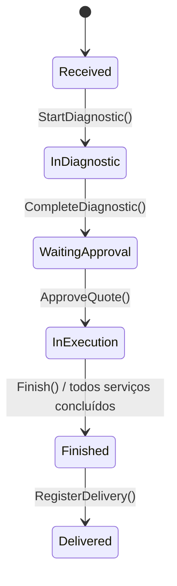

# Ordem de Serviço — Agregado Raiz Central

## Metadados
- Classe C#: `ServiceOrder`
- Tipo: Agregado Raiz Central
- Bounded Context: Gestão de Ordens de Serviço
- Namespace: `GarageFlow.Domain.ServiceOrders`
- Arquivo: `GarageFlow.Domain/ServiceOrders/ServiceOrder.cs`

## Responsabilidade
Representa o ciclo de vida completo da Ordem de Serviço (OS), desde o
recebimento até a entrega do veículo. É o agregado central do contexto,
coordenando diagnóstico, geração/aprovação de orçamento e progresso da
execução dos serviços contratados.

## Atributos
| Atributo | Tipo C# | Obrigatório | Regra |
|----------|---------|-------------|-------|
| Id | `Guid` | Sim | Gerado automaticamente via `Guid.NewGuid()` |
| CustomerId | `Guid` | Sim | Imutável após criação (RN-001) |
| VehicleId | `Guid` | Sim | Imutável após criação (RN-002) |
| Status | `ServiceOrderStatus` | Sim | Fluxo obrigatório: `Received -> InDiagnostic -> WaitingApproval -> InExecution -> Finished -> Delivered` (RN-003) |
| Diagnostic | `Diagnostic?` | Não | Nulo até `StartDiagnostic()` |
| Quote | `Quote?` | Não | Nulo até `CompleteDiagnostic()` |
| Items | `IReadOnlyList<ServiceItem>` | Sim | Deve conter pelo menos 1 item na criação |
| TotalServices | `int` | Sim | Definido na aprovação do orçamento (`Items.Count`) |
| CompletedServices | `int` | Sim | Incrementado por evento de conclusão de serviço |
| CreatedAt | `DateTime` | Sim | Definido como `DateTime.UtcNow` no `Create()` |
| UpdatedAt | `DateTime` | Sim | Atualizado a cada transição/mutação válida |

> **Enum `ServiceOrderStatus`:**
> ```
> Received, InDiagnostic, WaitingApproval, InExecution, Finished, Delivered
> ```

## Entidade Interna — ServiceItem
`ServiceItem` representa um snapshot do serviço contratado no momento da criação da OS.

| Atributo | Tipo C# | Obrigatório | Regra |
|----------|---------|-------------|-------|
| ServiceId | `Guid` | Sim | Referência ao serviço do catálogo |
| ServiceName | `string` | Sim | Nome do serviço no momento da contratação |
| UnitPrice | `decimal` | Sim | Preço unitário no momento da contratação |
| Quantity | `int` | Sim | Quantidade contratada; maior que zero |

## Invariantes
1. `CustomerId` nunca pode ser alterado após criação (RN-001)
2. `VehicleId` nunca pode ser alterado após criação (RN-002)
3. `Status` só pode avançar na sequência obrigatória, sem salto ou retorno (RN-003)
4. `Finish()` só pode executar quando `CompletedServices == TotalServices` (RN-004)
5. `Items` nunca pode ser vazio na criação da OS
6. `CompletedServices` nunca pode ser maior que `TotalServices`

## Diagrama de Estados


## Métodos de Domínio

### Create(Guid customerId, Guid vehicleId, IEnumerable<ServiceItem> items)
- Pré-condição: `customerId != Guid.Empty`
- Pré-condição: `vehicleId != Guid.Empty`
- Pré-condição: `items` não nulo e com pelo menos 1 item
- Pré-condição: cada `ServiceItem` deve ter:
  - `ServiceId != Guid.Empty`
  - `ServiceName` não nulo/não vazio após `trim`
  - `UnitPrice >= 0`
  - `Quantity > 0`
- Ação:
  - Cria instância com `Id = Guid.NewGuid()`
  - Define `Status = Received`
  - Define `Diagnostic = null`, `Quote = null`
  - Inicializa `TotalServices = 0`, `CompletedServices = 0`
  - Define `CreatedAt = DateTime.UtcNow` e `UpdatedAt = DateTime.UtcNow`
- Pós-condição: OS válida e pronta para iniciar diagnóstico
- Evento emitido: `ServiceOrderCreatedEvent`
- Exceções:
  - `DomainException("Cliente é obrigatório")`
  - `DomainException("Veículo é obrigatório")`
  - `DomainException("OS deve ter pelo menos um serviço")`
  - `DomainException("Item de serviço inválido")`

### StartDiagnostic(Guid mechanicId)
- Pré-condição: `Status == Received`
- Pré-condição: `mechanicId != Guid.Empty`
- Ação:
  - Define `Status = InDiagnostic`
  - Cria `Diagnostic` internamente via `Diagnostic.Start(Id, mechanicId)`
  - Atualiza `UpdatedAt`
- Pós-condição: diagnóstico em andamento
- Evento emitido: `DiagnosticStartedEvent`
- Exceções:
  - `DomainException("OS não está no status Recebida")`
  - `DomainException("Id do mecânico inválido")`

### CompleteDiagnostic(string description)
- Pré-condição: `Status == InDiagnostic`
- Pré-condição: `Diagnostic` existente
- Pré-condição: `description` não nula/não vazia
- Ação:
  - Aplica `trim` em `description` (somente bordas)
  - Conclui `Diagnostic` interno
  - Gera `Quote` automaticamente com base em `Items`
  - Define `Status = WaitingApproval`
  - Atualiza `UpdatedAt`
- Pós-condição: diagnóstico concluído e orçamento pendente de aprovação
- Eventos emitidos:
  - `DiagnosticCompletedEvent`
  - `QuoteGeneratedEvent`
- Exceção: `DomainException("OS não está em Diagnóstico")`

### ApproveQuote()
- Pré-condição: `Status == WaitingApproval`
- Pré-condição: `Quote` existente e pendente
- Ação:
  - Aprova `Quote` interno
  - Define `TotalServices = Items.Count`
  - Define `CompletedServices = 0`
  - Define `Status = InExecution`
  - Atualiza `UpdatedAt`
- Pós-condição: OS em execução e contador preparado
- Eventos emitidos:
  - `QuoteApprovedEvent`
  - `ServiceOrderInExecutionEvent`
- Exceção: `DomainException("OS não está Aguardando Aprovação")`

### IncrementCompletedServices()
- Pré-condição: `Status == InExecution`
- Ação:
  - Incrementa `CompletedServices++`
  - Se `CompletedServices == TotalServices`, chama `Finish()`
  - Atualiza `UpdatedAt`
- Pós-condição: contador de concluídos atualizado; OS pode ser finalizada automaticamente
- Exceção: `DomainException("OS não está Em Execução")`

> `IncrementCompletedServices()` não publica evento de finalização diretamente.
> Quando o total é atingido, ele delega para `Finish()`, que é a fonte única de
> `ServiceOrderFinishedEvent`.

> **Comentário obrigatório — mecanismo do contador (`TotalServices`/`CompletedServices`):**
> Ao aprovar o orçamento, `TotalServices` é fixado com `Items.Count` e `CompletedServices` reinicia em `0`.
> Cada conclusão de serviço (normalmente via evento de Produção) chama `IncrementCompletedServices()`,
> que incrementa o progresso em uma unidade e verifica imediatamente o critério da RN-004.
> Quando `CompletedServices` alcança `TotalServices`, a própria OS dispara `Finish()` automaticamente,
> garantindo finalização determinística e impedindo encerramento prematuro.

### Finish()
- Pré-condição: `CompletedServices == TotalServices` (RN-004)
- Ação:
  - Define `Status = Finished`
  - Atualiza `UpdatedAt`
- Pós-condição: OS finalizada
- Evento emitido: `ServiceOrderFinishedEvent`
- Exceção: `DomainException("Existem serviços pendentes")`

### RegisterDelivery()
- Pré-condição: `Status == Finished`
- Ação:
  - Define `Status = Delivered`
  - Atualiza `UpdatedAt`
- Pós-condição: veículo entregue ao cliente
- Evento emitido: `VehicleDeliveredEvent`
- Exceção: `DomainException("OS não está Finalizada")`

## Eventos de Domínio
| Evento C# | Quando é emitido |
|-----------|-----------------|
| `ServiceOrderCreatedEvent` | Ao criar a OS |
| `DiagnosticStartedEvent` | Ao iniciar diagnóstico |
| `DiagnosticCompletedEvent` | Ao concluir diagnóstico |
| `QuoteGeneratedEvent` | Ao gerar orçamento automaticamente após diagnóstico |
| `QuoteApprovedEvent` | Ao aprovar orçamento |
| `ServiceOrderInExecutionEvent` | Ao colocar OS em execução |
| `ServiceOrderFinishedEvent` | Ao finalizar OS |
| `VehicleDeliveredEvent` | Ao registrar entrega do veículo |

## Regras de Negócio Relacionadas
- [RN-001]: `CustomerId` é imutável após criação
- [RN-002]: `VehicleId` é imutável após criação
- [RN-003]: Progressão de status obrigatória
- [RN-004]: Finalização só quando `CompletedServices == TotalServices`
- [RN-006]: Uma OS só pode ter um diagnóstico ativo por vez
- [RN-007]: Orçamento só pode ser gerado após diagnóstico concluído

## Implementação C#
- Construtor privado
- Factory method estático `Create()`
- Propriedades com `private set`
- Exceções sempre via `DomainException`
- Normalização textual: aplicar `trim` nas bordas em entradas de texto do agregado

## Dependências
- Entidades internas: `Diagnostic`, `Quote`
- Tipo de suporte interno: `ServiceItem`
- Agregados externos referenciados por ID: `Customer`, `Vehicle`, `Service`

## Testes Obrigatórios
- [ ] criar OS válida
- [ ] criar sem cliente (erro)
- [ ] criar sem veículo (erro)
- [ ] criar sem itens (erro)
- [ ] criar com `ServiceItem` inválido (erro)
- [ ] iniciar diagnóstico em OS Received
- [ ] iniciar diagnóstico em status errado (erro)
- [ ] completar diagnóstico
- [ ] aprovar orçamento
- [ ] aprovar em status errado (erro)
- [ ] incrementar serviços concluídos
- [ ] finalizar quando todos concluídos
- [ ] finalizar automaticamente via incremento deve emitir `ServiceOrderFinishedEvent` exatamente uma vez
- [ ] tentar finalizar com serviços pendentes (erro)
- [ ] registrar entrega
- [ ] registrar entrega em status errado (erro)
- [ ] tentar alterar CustomerId (erro)
- [ ] tentar alterar VehicleId (erro)
