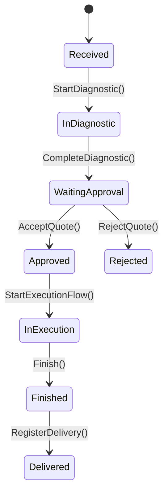

# Ordem de Serviço — Agregado Raiz Central

## Metadados
- Classe C#: `ServiceOrder`
- Tipo: Agregado Raiz Central
- Bounded Context: Gestão de Ordens de Serviço
- Namespace: `GarageFlow.Domain.ServiceOrders`
- Arquivo: `GarageFlow.Domain/ServiceOrders/ServiceOrder.cs`

## Responsabilidade
Controla o ciclo de vida completo da OS, incluindo diagnóstico,
orçamento, aprovação, execução e entrega.

## Atributos
| Atributo | Tipo C# | Obrigatório | Regra |
|----------|---------|-------------|-------|
| Id | `Guid` | Sim | Gerado automaticamente |
| CustomerId | `Guid` | Sim | Imutável após criação |
| VehicleId | `Guid` | Sim | Imutável após criação |
| Status | `ServiceOrderStatus` | Sim | Fluxo canônico da OS |
| Diagnostic | `Diagnostic?` | Não | Nulo até iniciar diagnóstico |
| Quote | `Quote?` | Não | Nulo até concluir diagnóstico |
| QuoteVersion | `int` | Sim | Versão atual do orçamento (incremental) |
| Items | `IReadOnlyList<ServiceItem>` | Sim | Snapshot interno usado no orçamento |
| Services | `IReadOnlyList<ServiceOrderServiceItem>` | Sim | Serviços da OS com origem e estado |
| ServiceHistory | `IReadOnlyList<ServiceOrderServiceHistory>` | Sim | Log append-only das alterações de serviço |
| TotalServices | `int` | Sim | Definido ao aprovar orçamento |
| CompletedServices | `int` | Sim | Incrementado na conclusão das execuções |
| CreatedAt | `DateTime` | Sim | Definido no `Create()` |
| UpdatedAt | `DateTime` | Sim | Atualizado em transições |

### Enum ServiceOrderStatus
`Received | InDiagnostic | WaitingApproval | Approved | Rejected | InExecution | Finished | Delivered`

## Tipo Interno — ServiceItem (snapshot)
`ServiceItem` copia dados estruturais do catálogo para preservar histórico da OS.

| Atributo | Tipo C# | Obrigatório | Regra |
|----------|---------|-------------|-------|
| ServiceId | `Guid` | Sim | Referência ao serviço de catálogo |
| ServiceName | `string` | Sim | Snapshot textual |
| Parts | `IReadOnlyList<ServiceItemPart>` | Sim | Snapshot de peças do serviço |
| Supplies | `IReadOnlyList<ServiceItemSupply>` | Sim | Snapshot de insumos do serviço |

### ServiceItemPart
`PartId`, `PartName`, `Quantity`

### ServiceItemSupply
`SupplyId`, `SupplyName`, `Quantity`, `Unit`

## Tipo Interno — ServiceOrderServiceItem (rastreável)
`ServiceOrderServiceItem` representa o serviço selecionado na OS antes do snapshot final de orçamento.

| Atributo | Tipo C# | Obrigatório | Regra |
|----------|---------|-------------|-------|
| ServiceId | `Guid` | Sim | Referência ao serviço de catálogo |
| Source | `ServiceSource` | Sim | `FrontDesk` ou `Diagnostic` |
| IsActive | `bool` | Sim | `false` quando removido |
| AddedAt | `DateTime` | Sim | Data/hora da inclusão |
| AddedBy | `Guid` | Sim | Ator responsável pela inclusão |
| RemovedAt | `DateTime?` | Não | Data/hora da remoção |
| RemovedBy | `Guid?` | Não | Ator responsável pela remoção |
| RemovalReason | `string?` | Não | Motivo da remoção |

### Tipo Interno — ServiceOrderServiceHistory (append-only)
`Action`, `ServiceId`, `Source`, `ActorId`, `OccurredAt`, `Reason?`

Regra de preço:
- `ServiceItem` não armazena preço.
- preços são resolvidos na geração de `Quote`.

## Invariantes
1. `CustomerId` e `VehicleId` imutáveis
2. progressão de status sem salto/retorno
3. finalização só com `CompletedServices == TotalServices`
4. diagnóstico concluído não pode ser reaberto
5. diagnóstico deve concluir com pelo menos 1 serviço selecionado
6. alterações de serviços da OS exigem rastreabilidade completa (origem/ator/tempo)
7. após diagnóstico concluído, composição de serviços ativos é congelada para orçamento

## Fluxo de Estado

## Métodos de Domínio

### Create(Guid customerId, Guid vehicleId)
- cria OS em `Received`
- `Items` inicia vazio

### StartDiagnostic(Guid mechanicId)
- pré-condição: `Status == Received`
- cria `Diagnostic` em `InProgress`
- evento de integração canônico: `DiagnosticStartedEvent`

### AddService(Guid serviceId, Guid actorId, ServiceSource source)
- pré-condição: serviço ativo de catálogo
- pré-condição: sem duplicidade ativa por `ServiceId`
- ação:
  - inclui item em `Services`
  - registra entrada em `ServiceHistory`

### RemoveService(Guid serviceId, Guid actorId, ServiceSource source, string reason)
- pré-condição: serviço ativo existente na OS
- pré-condição: motivo obrigatório
- ação:
  - marca item como removido (`IsActive = false`)
  - registra entrada em `ServiceHistory`

### CompleteDiagnostic(string description)
- pré-condição: `Status == InDiagnostic`
- pré-condição: diagnóstico com ao menos 1 serviço selecionado
- ação:
  - conclui diagnóstico
  - monta `ServiceItem` a partir dos serviços selecionados e suas composições de catálogo
  - gera `Quote` com:
    - `LaborPrice` via `Service.BasePrice`
    - totais de peças e insumos via catálogo
  - muda status para `WaitingApproval`
  - congela composição de serviços ativos
- eventos:
  - integração canônica: `DiagnosticCompletedEvent`
  - integração canônica: `QuoteGeneratedEvent`

### AcceptQuote()
- pré-condição: `Status == WaitingApproval`
- aprova orçamento atual e muda para `Approved`
- eventos:
  - integração canônica: `QuoteApprovedEvent`

### RejectQuote()
- pré-condição: `Status == WaitingApproval`
- ação: rejeita orçamento atual sem alterar itens/valores da versão rejeitada e muda status para `Rejected`
- observação: nova mudança de escopo exige retorno ao atendimento e nova versão de orçamento

### Finish()
- pré-condição: `Status == InExecution`
- muda para `Finished`
- evento de domínio interno: `ServiceOrderFinishedEvent`

### RegisterDelivery()
- observação: transição `Finished -> Delivered` permanece no canônico, mas método ainda não está implementado nesta fase do código.

## Classificação de Eventos
- Eventos de integração canônicos deste agregado: `DiagnosticStartedEvent`, `DiagnosticCompletedEvent`, `QuoteGeneratedEvent`, `QuoteApprovedEvent`.
- Eventos de domínio internos (não listados como contratos de integração): `ServiceOrderInExecutionEvent`, `ServiceOrderFinishedEvent`, `VehicleDeliveredEvent`.
- Catálogo canônico de integração: [docs/domain/agregados.md](../../../domain/agregados.md).

## Regras de Negócio Relacionadas
- [RN-001], [RN-002], [RN-003], [RN-004]
- [RN-006], [RN-007]
- [RN-026], [RN-028]
- [RN-029], [RN-030], [RN-031]

## Testes Obrigatórios
- [ ] iniciar diagnóstico
- [ ] adicionar/remover serviço no atendimento com rastreabilidade
- [ ] adicionar/remover serviços no diagnóstico em `InProgress`
- [ ] impedir alteração após `Completed`
- [ ] congelar serviços após conclusão do diagnóstico
- [ ] concluir diagnóstico sem serviços (erro)
- [ ] gerar `ServiceItem` com snapshot de peças/insumos
- [ ] gerar `Quote` com `LaborPrice` vindo de `Service.BasePrice`
- [ ] aceitar orçamento
- [ ] rejeitar orçamento
- [ ] finalizar em `InExecution`
